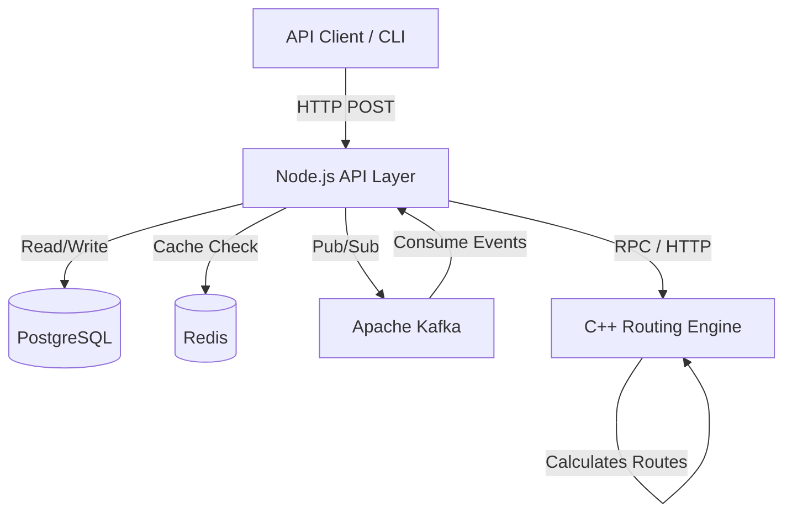
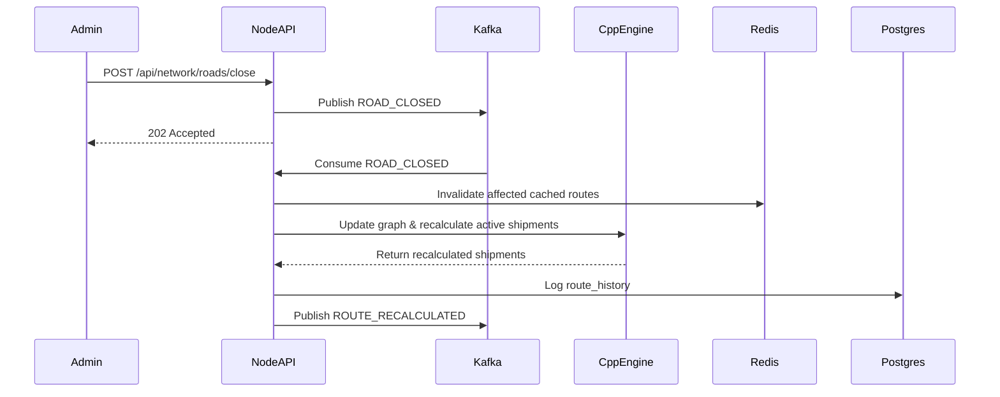

# High Level Design (HLD)

## 1. System Architecture
The Dynamic Route Optimizer uses a modern event-driven microservices architecture designed for high availability and low latency.

## 2. Scalability Approach
*   **1K to 10K requests/sec**: 
    *   **Node.js API Layer**: Deployed as stateless containers. Can scale horizontally behind a Load Balancer (e.g., AWS ALB).
    *   **C++ Routing Engine**: Completely stateless (graph state is synced). Can be scaled horizontally.
*   **Database**: PostgreSQL handles transactional data (Orders, Route History). Read replicas can be added for high read throughput.
*   **Caching**: Redis offloads 90% of the read traffic for frequently requested routes.

## 3. Failure Handling & Resilience
*   **Node.js Failure**: Stateless; the Load Balancer routes to healthy instances.
*   **C++ Engine Failure**: Node.js clients implement retries. If the engine crashes, Docker/ECS automatically restarts it.
*   **Kafka Failure**: Messages are persisted to disk. Consumers track offsets and resume upon recovery.
*   **Redis Failure**: Graceful degradation. If Redis is down, the system falls back to calculating routes directly via the C++ engine (slower, but functional).

## 4. Asynchronous Event Flow (ROAD_CLOSED)

---

# AWS Deployment Strategy (Phase 15)

Although built for local Docker Compose, this architecture maps directly to managed AWS services:

1.  **Node.js API & C++ Engine** -> **Amazon ECS (Fargate) or EKS**. (Allows serverless container scaling based on CPU/RAM).
2.  **PostgreSQL** -> **Amazon RDS for PostgreSQL**. (Provides automated backups, Multi-AZ high availability).
3.  **Redis** -> **Amazon ElastiCache for Redis**. (Fully managed in-memory datastore).
4.  **Kafka** -> **Amazon MSK (Managed Streaming for Apache Kafka)**.
5.  **Traffic Routing** -> **AWS Application Load Balancer (ALB)**.
6.  **Monitoring** -> **Amazon CloudWatch** (Logs and Metrics).
