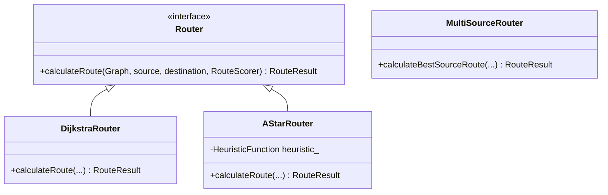

# Low Level Design (LLD)

## 1. C++ Routing Engine Design
The core engine is built in C++17 utilizing strict Object-Oriented principles.

### Strategy Pattern for Algorithms
To support multiple routing algorithms without modifying core logic, we use the Strategy Pattern:

### Route Scoring Config
Instead of hardcoding distance optimization, the `RouteScorer` class weights multiple variables:
*   `timeWeight`
*   `distanceWeight`
*   `congestionWeight`
*   `costWeight`

## 2. Concurrency Model
The `Graph` object uses `std::shared_mutex`.
*   **Readers** (Route Calculation): Use `std::shared_lock`. Multiple threads can calculate routes simultaneously.
*   **Writers** (Edge Closure): Use `std::unique_lock`. When a network update happens, it gains exclusive access to safely modify the adjacency list without causing segfaults.

## 3. Data Structures
*   **Graph**: Adjacency list `std::unordered_map<std::string, std::vector<Edge>>` for O(1) node lookup and efficient edge traversal.
*   **Priority Queue**: `std::priority_queue` (Min-Heap) used in Dijkstra and A* to always expand the lowest-cost path next.
